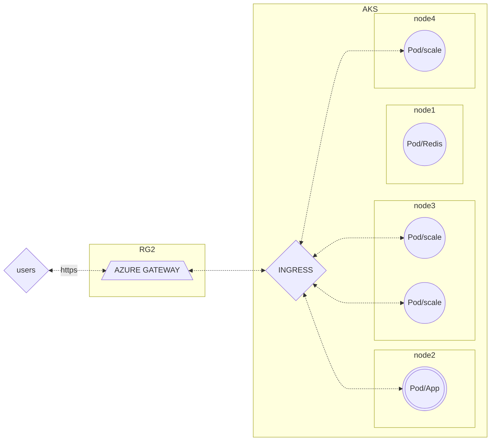

# BRIEF_6_KUBERNETES : DOCUMENTATION TECHNIQUE

## 1.PRESENTATION DE L'APPLICATION 
L'application est un site interactif où l'ont peut voter soit pour des chiens soit pour des chats. 

L'application deployé est disponible via un repository d'une image Docker répertorié dans un registry public présent dans le Docker Hub
Site : 
https://hub.docker.com/
Registry : https://hub.docker.com/r/whujin11e/public

## 2.LE DEPLOIEMENT DANS L'ENVIRONNEMENT AZURE
L'infrastructure est hébergé sur le Cloud Microsoft AZURE et a été déployé en utilisant le service Azure Kubernetes Service (AKS)
AKS est un service managé (responsable de la surchage opérationnelle, l'administrateur est uniquement en charge de la gestion/maintenance des noeuds agents) d'orchestrateur de container basé sur le système KUBERNETES.

L'ensemble des opérations ont été réalisé via : 

- Ligne de commande AZ CLI pour deployer les ressources groupes AZURE nécéssaire.
- Des extensions AZ CLI pour déployer le Cluster AKS et faire appels aux commandes de gestions des objets du cluster Kubernetes (kubectl). 
- L'activation d'un module complémentaire  Application Gateway Ingress Controller (AGIC) pour une opération de mise en place réseau avec Azure Gateway.

## 3. LE ROUTAGE

Dans cette infrastructure, les requêtes vers l'application transit via un service Azure Gateway existant. C'est-à-dire que le Cluster AKS expose une autre ressource d'un autre groupe de ressource mise en service dans AZURE via un point d'entrée Ingress.
Avantages : 
- Pas de création ni d'exposition d'une IPpublic au sein du Cluster
- Bénéficie du Load Balancer du service Azure Gateway de la ressource existante
- Permet d'être configuré en HTTPS 

## 4. LE STOCKAGE 
Dans Kubernetes le stockage est volatile (non-persistent si le node disparait).
Dans cette infrastructure, une solution AZURE FILE à été implémenté

 faire un mermaid stockage**

## 5. LES DIFFICULTES RENCONTREES 

Regarder dans le Scrum**
Point d'amélioration**
Noter les difficultés ET leur solutions**

*Par Andriamarofahatra Stéphane*
Lien Github de cette documentation
