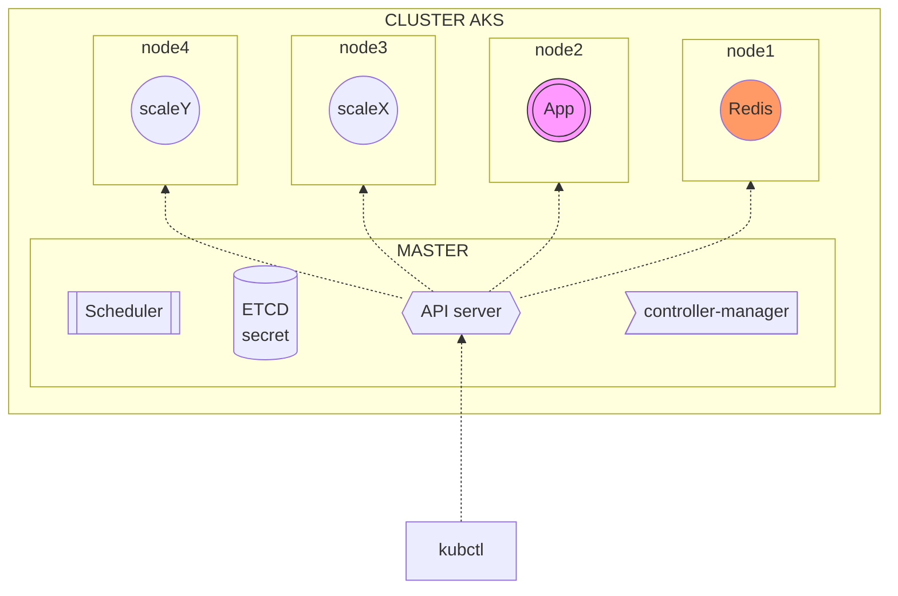
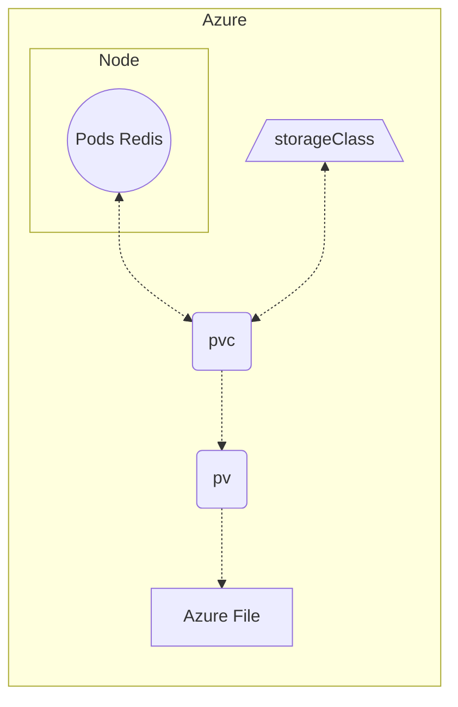
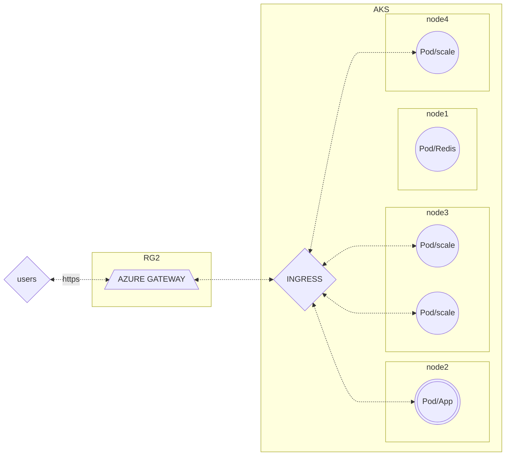

# BRIEF_6_KUBERNETES : EXECUTIVE SUMMARY

## 1.PRESENTATION DE L'APPLICATION 
L'application est un site interactif où l'ont peut voter soit pour des chiens soit pour des chats. 

L'application deployé est disponible via un repository d'une image Docker répertorié dans un registry public présent dans le Docker Hub
Site : 
https://hub.docker.com/
Registry : https://hub.docker.com/r/whujin11e/public

## 2.LE DEPLOIEMENT DANS L'ENVIRONNEMENT AZURE
L'infrastructure est hébergé dans le Cloud Microsoft AZURE et a été mis en ligne en utilisant le service Azure Kubernetes Service (AKS).
AKS est un service managé (responsable de la surchage opérationnelle, l'administrateur est uniquement en charge de la gestion/maintenance des noeuds agents) d'orchestrateur de container basé sur le système KUBERNETES.

L'ensemble des opérations ont été réalisé via : 

- Ligne de commande AZ CLI pour deployer les deux ressources groupes AZURE nécéssaires.
- L'outil en ligne Kubectl pour la gestion des objets du cluster Kubernetes. 
- L'activation d'un module complémentaire  Application Gateway Ingress Controller (AGIC) pour une opération de mise en place réseau avec Azure Gateway.

*Représentation du déploiement de l'infrastructure via l'outil en ligne kubectl*

Les ressources :
* Deux groupes de ressources;
* Un Cluster AKS;
* 4 Noeuds;
* 1 Pod qui héberge une base de donnée contenant un container avec une image REDIS;
* 1 Pod qui héberge un container avec l'image de l'application de vote;
* Un Service AZURE GATEWAY;

## 3. LE STOCKAGE 

Initialement dans Docker le stockage est volatile (non-persistent si le node disparait).
Dans cette infrastructure, une solution de fichier  à été implémenté pour la sauvegarde.

Création d'un volume persistant via un point de montage dans REDIS. 
Ce volume local est mis en relation a un système de stockage persistant dans Kubernetes qui permet la création dynamique d'un volume : 
StorageClass, un Azure File, un Persistante Volume Claim et un Persistant Volume.

 

## 4. LE ROUTAGE

Dans cette infrastructure, les requêtes vers l'application transit via un service Azure Gateway existant. C'est-à-dire que le Cluster AKS expose une autre ressource d'un autre groupe de ressource mise en service dans AZURE via un point d'entrée Ingress.

- Pas de création ni d'exposition d'une IPpublic au sein du Cluster.
- Bénéficie du Load Balancer du service Azure Gateway de la ressource existante.
- Le service peut-être configuré en HTTPS.

## 5. NOTES 

Difficultés rencontrées :

* Difficultés des mises en relation entre les différents composants des fichiers YAML à travers le brief.
* Temps de compréhension des concepts. 
* Documentation Kubernetes moins intuitive que Terraform. 

Axes d'améliorations: 
Noter les difficultés ET que les solutions trouvées au fur et à mesure.
Optimiser l'environnement de travail (L'organisation de la prise de note, journal de bord)

Merci pour la lecture de ce document

*Par Andriamarofahatra Stéphane*
